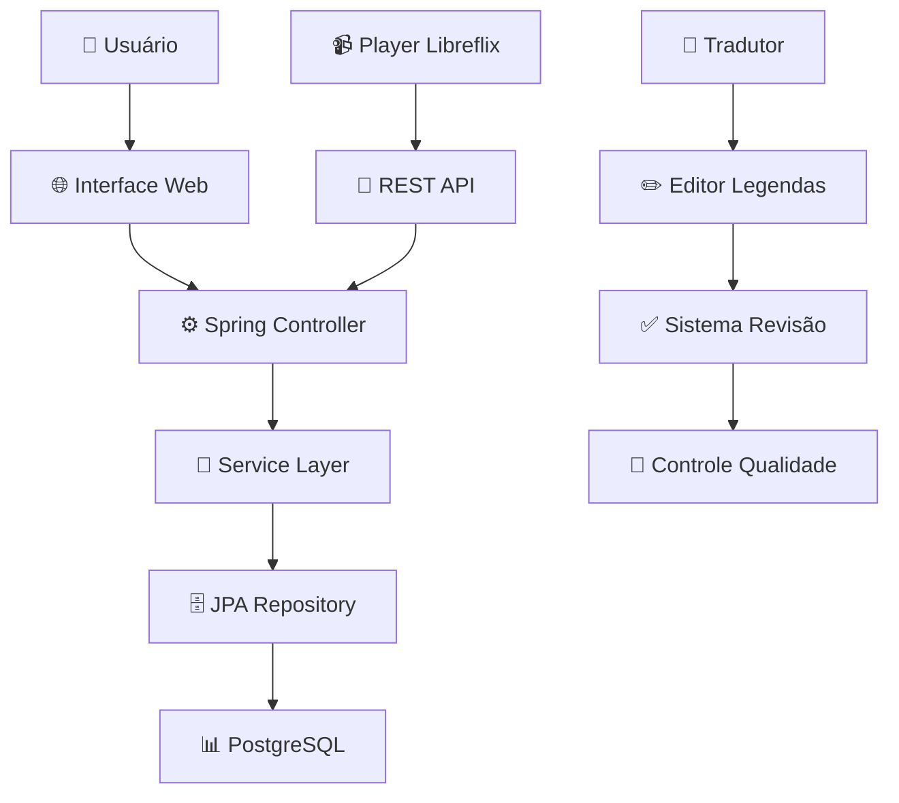

<div align="center">


<p align="center">
  
</p>

<p align="center">
  
  
  
  
</p>

</div>

## 📋 Sobre o Projeto

O **SUBlime** é um sistema completo de gerenciamento de legendas desenvolvido para a plataforma **Libreflix**, focando em acessibilidade, colaboração e qualidade. A plataforma permite que tradutores voluntários contribuam com legendas em múltiplos idiomas, tornando o conteúdo audiovisual acessível para comunidades globais.

### 🎯 Missão
*Democratizar o acesso ao conteúdo audiovisual através de legendas de qualidade em diversos idiomas*

### ✨ Destaques

| **Característica** | **Benefício** |
|-------------------|---------------|
| 🌐 **Suporte Multi-idioma** | Conteúdo acessível globalmente |
| 👥 **Sistema Colaborativo** | Comunidade ativa de tradutores |
| ✅ **Controle de Qualidade** | Legendas revisadas e validadas |
| 🔄 **Sincronização Precisa** | Experiência de visualização perfeita |
| 📊 **API RESTful** | Integração seamless com Libreflix |

---

## 🏗️ Arquitetura do Sistema

### 📊 Stack Tecnológica

| **Camada** | **Tecnologia** | **Finalidade** |
|------------|----------------|----------------|
| **Backend** | Spring Boot 3.0, Java 21 | API REST e lógica de negócio |
| **Banco de Dados** | PostgreSQL 15 | Armazenamento de legendas e metadados |
| **Frontend** | Thymeleaf, Bootstrap | Interface web responsiva |
| **Build Tool** | Maven | Gerenciamento de dependências |
| **Contêineres** | Docker | Ambiente consistente |

### 🔧 Componentes Principais



---

## ⚙️ Funcionalidades Principais

### 🎯 Módulo de Legendas

| **Funcionalidade** | **Descrição** | **Tecnologia** |
|-------------------|---------------|----------------|
| **Upload de Legendas** | Suporte a formatos .srt, .vtt | Spring Multipart |
| **Editor Integrado** | Edição em tempo real | JavaScript + REST API |
| **Sincronização** | Ajuste automático de timing | Algoritmos Java |
| **Tradução Colaborativa** | Múltiplos tradutores por projeto | Spring Security |

### 👥 Módulo de Colaboração

| **Funcionalidade** | **Descrição** | **Benefício** |
|-------------------|---------------|---------------|
| **Sistema de Revisão** | Fluxo de aprovação em etapas | Qualidade garantida |
| **Comentários em Tempo Real** | Feedback durante tradução | Colaboração eficiente |
| **Histórico de Versões** | Controle de mudanças | Rastreabilidade |
| **Ranking de Colaboradores** | Reconhecimento da comunidade | Engajamento |

### 🌐 Módulo de API

- **🔗 API RESTful** para integração com Libreflix
- **📡 Spring Security** para autenticação JWT
- **🔄 Spring Data JPA** para persistência
- **📊 Spring Actuator** para métricas

---

## 🚀 Como Executar

### 📋 Pré-requisitos

| **Componente** | **Versão** | **Download** |
|----------------|------------|--------------|
| **Java JDK** | 21+ | [Oracle JDK](https://www.oracle.com/java/) |
| **Maven** | 3.8+ | [Apache Maven](https://maven.apache.org/) |
| **PostgreSQL** | 15+ | [PostgreSQL](https://www.postgresql.org/) |

### 🛠️ Configuração

#### 1. 📥 Clone o Repositório
```bash
git clone https://github.com/P-E-N-T-E-S/SUBlime.git
cd SUBlime
```

#### 2. 🗄️ Configure o Banco de Dados
```sql
CREATE DATABASE sublime_db;
CREATE USER sublime_user WITH PASSWORD 'sublime_pass';
GRANT ALL PRIVILEGES ON DATABASE sublime_db TO sublime_user;
```

#### 3. ⚙️ Configure a Aplicação
Crie o arquivo `application.properties`:

```properties
# Datasource
spring.datasource.url=jdbc:postgresql://localhost:5432/sublime_db
spring.datasource.username=sublime_user
spring.datasource.password=sublime_pass

# JPA
spring.jpa.hibernate.ddl-auto=update
spring.jpa.show-sql=true

# Server
server.port=8080
```

#### 4. 🏃 Execute a Aplicação
```bash
# Com Maven
mvn spring-boot:run

# Ou compile e execute
mvn clean package
java -jar target/sublime-1.0.0.jar
```

#### 5. 🌐 Acesse a Aplicação
```url
http://localhost:8080
```

---

## 📁 Entregas do Projeto

### 🔗 Links Importantes

| **Recurso** | **Link** | **Descrição** |
|-------------|----------|---------------|
| **🌐 Site** | [Em Desenvolvimento]() | Plataforma principal |
| **📋 Trello** | [Board do Projeto](https://trello.com/invite/b/dfNl7JhX/ATTI468d889712155dde5091b5c52651de98C12170EB/g7-projetos) | Gestão de tarefas |
| **📐 Diagrama** | [Miro Board](https://miro.com/app/board/uXjVKPxfMps=/?share_link_id=204390211874) | Diagrama de Classes |

### 📊 Sprint Reviews

#### SR1 - Fundamentação
| **Artefato** | **Link** | **Status** |
|--------------|----------|------------|
| **🎨 Protótipo Baixa** | [Figma](https://www.figma.com/file/ME0MIPGPEdVN3fnxUn5nZm/SR1-G7) | ✅ Completo |
| **🎥 ScreenCast** | [YouTube](https://youtu.be/lhjmrrAkc8U) | ✅ Publicado |
| **📐 Diagrama UML** | [Google Drive](https://drive.google.com/file/d/13mw6zXzHFx-cdkf6Z8z618XEMM_5R1Tb/view) | ✅ Finalizado |
| **🐛 Issue Tracker** | [GitHub Issues](https://github.com/P-E-N-T-E-S/SUBlime/issues) | ✅ Ativo |

#### SR2 - Desenvolvimento
| **Artefato** | **Link** | **Status** |
|--------------|----------|------------|
| **🎥 Demonstração** | [YouTube](https://youtu.be/1A02IdR7pL4) | ✅ Publicado |
| **🎨 Protótipo Alta** | [Figma](https://www.figma.com/design/6TWhj6ZsTJszeTfigWxDIr/prot%C3%B3tipo-de-alta) | ✅ Finalizado |
| **📋 Histórias** | [Google Docs](https://docs.google.com/document/d/1wFz7SzBdo2L3zbgBy0N4Jn3ePgD-kvWxSNDXSMr46Ag/edit) | ✅ Documentado |
| **🐛 Bug Tracker** | [GitHub Issues](https://github.com/P-E-N-T-E-S/G7/issues) | ✅ Monitorado |

---

## 👥 Equipe do Projeto

<div align="center">

### 🎨 Time de Design

<table>
  <tr>
    <td align="center">
      <sub><b>Larissa Maria</b></sub><br>
      <sub>lmwn@cesar.school</sub><br>
      <sub>🎯 UX Research</sub>
    </td>
    <td align="center">
      <sub><b>Letícia Souto</b></sub><br>
      <sub>lsmb@cesar.school</sub><br>
      <sub>✨ UI Design</sub>
    </td>
    <td align="center">
      <sub><b>Marina Passos</b></sub><br>
      <sub>mps3@cesar.school</sub><br>
      <sub>🎨 Visual Design</sub>
    </td>
  </tr>
  <tr>
    <td align="center" colspan="2">
      <sub><b>Ana Letícia</b></sub><br>
      <sub>alcs2@cesar.school</sub><br>
      <sub>📱 Interface Design</sub>
    </td>
    <td align="center">
      <sub><b>Lucas Maciel</b></sub><br>
      <sub>lmf2@cesar.school</sub><br>
      <sub>🔧 Design System</sub>
    </td>
  </tr>
</table>

### 💻 Time de Desenvolvimento

<table>
  <tr>
    <td align="center">
      <a href="https://github.com/Thomazrlima">
        <br>
        <sub><b>Thomaz Lima</b></sub><br>
        <sub>trl@cesar.school</sub><br>
        <sub>🗄️ Spring Boot & JPA</sub>
      </a>
    </td>
    <td align="center">
      <a href="https://github.com/hsspedro">
        <br>
        <sub><b>Pedro Silva</b></sub><br>
        <sub>phss@cesar.school</sub><br>
        <sub>⚡ API REST</sub>
      </a>
    </td>
    <td align="center">
      <a href="https://github.com/Sofia-Saraiva">
        <br>
        <sub><b>Sofia Saraiva</b></sub><br>
        <sub>spscl@cesar.school</sub><br>
        <sub>🎨 Thymeleaf Frontend</sub>
      </a>
    </td>
  </tr>
  <tr>
    <td align="center" colspan="2">
      <a href="https://github.com/Nerebo">
        <br>
        <sub><b>André Goes</b></sub><br>
        <sub>algcf@cesar.school</sub><br>
        <sub>🔧 Spring Security</sub>
      </a>
    </td>
    <td align="center">
      <a href="https://github.com/Tiagopbc">
        <br>
        <sub><b>Tiago Cavalcanti</b></sub><br>
        <sub>tpbc@cesar.school</sub><br>
        <sub>🎯 Testes & QA</sub>
      </a>
    </td>
  </tr>
</table>

<br>

<a href="https://github.com/P-E-N-T-E-S/SUBlime/graphs/contributors">
  
</a>

</div>

---

## 📄 Licença

Este projeto está licenciado sob a **MIT License** - veja o arquivo [LICENSE](LICENSE) para detalhes.

---

<div align="center">

**🎬 Tornando o mundo mais acessível, uma legenda de cada vez**

*Desenvolvido com ☕ Java Spring pela equipe P.E.N.T.E.S. para a comunidade Libreflix*

</div>
